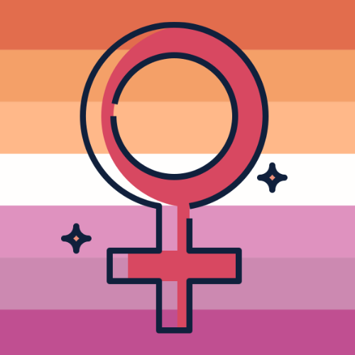
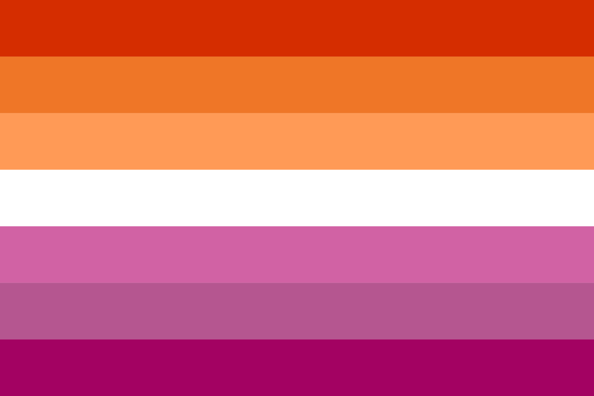

 
 <h2 align="center">Lesbians Vibes</h2>

# Lesbians Vibes

Lesbians Vibes is an app created a safe space for the Lesbians comminit in a way to be able to be yourself and enjoy the good vibes.

## ✨ Requirements

- Any Operating System (ie. MacOS X, Linux, Windows)
- Internet Browser (ie. Google Chrome)
- Source Code Editor (ie. VSCode)
- MongoDb
- npm (use npm run dev to intialize the project)

# Project Plan

- ✨ Overall idea - Profile Show Page - About Page (Future Implementation)
  - Sign-up Form/Login Page:
    - Profile Page and Favorites
    - Search Bar Component found on most components
- ✨ Name: Lesbians Vibes
- ✨ Design/look
  - Font: BlackMango (Font in logo, from Canva)
  - Colors: https://upload.wikimedia.org/wikipedia/commons/3/35/Lesbian_Pride_Flag_2019.svg
  

  
   <h2 align="center">Color Palette Ideas using Material UI</h2>

---

### :hammer_and_wrench: Languages and Tools :

- ✨ Front-end: React, Bootstrap
- ✨ Back-end: Express, Node.js, Postgres

  - Packages: Express, NodeJS

- ✨ Database: PostgreSQL

## ✨ Future Tasks✨

- Convert into TypeScript
- Use SASS for styling
- Adding more Web Accessibilty features

## ✨ Resources:

- Social Media app github examples

- Websites

- Images
  - https://www.canva.com/design/DAFudo8dYUk/-rVKbfZ2TCEHRzI5OVICQw/view?utm_content=DAFudo8dYUk&utm_campaign=designshare&utm_medium=link&utm_source=publishsharelink&mode=preview
- Github Version control/editing process
  - https://uoftcoders.github.io/studyGroup/lessons/git/collaboration/lesson/

## 👤 Author(s)

- Eric Bunn: [@GR33NAP3](https://github.com/GR33NAP3)
- Fernanda Kennedy: [@FernandaRKennedy](https://github.com/
  FernandaRKennedy)
- Kinsley Alexander: [@kins0803](https://github.com/kins0803)
- Skaya Mokma: [@SkayaMokma](https://github.com/SkayaMokma)

## 📝 License

MIT License

Copyright (c) 2023 Fernanda Kennedy

Permission is hereby granted, free of charge, to any person obtaining a copy
of this software and associated documentation files (the "Software"), to deal
in the Software without restriction, including without limitation the rights
to use, copy, modify, merge, publish, distribute, sublicense, and/or sell
copies of the Software, and to permit persons to whom the Software is
furnished to do so, subject to the following conditions:

The above copyright notice and this permission notice shall be included in all
copies or substantial portions of the Software.

THE SOFTWARE IS PROVIDED "AS IS", WITHOUT WARRANTY OF ANY KIND, EXPRESS OR
IMPLIED, INCLUDING BUT NOT LIMITED TO THE WARRANTIES OF MERCHANTABILITY,
FITNESS FOR A PARTICULAR PURPOSE AND NONINFRINGEMENT. IN NO EVENT SHALL THE
AUTHORS OR COPYRIGHT HOLDERS BE LIABLE FOR ANY CLAIM, DAMAGES OR OTHER
LIABILITY, WHETHER IN AN ACTION OF CONTRACT, TORT OR OTHERWISE, ARISING FROM,
OUT OF OR IN CONNECTION WITH THE SOFTWARE OR THE USE OR OTHER DEALINGS IN THE
SOFTWARE.
